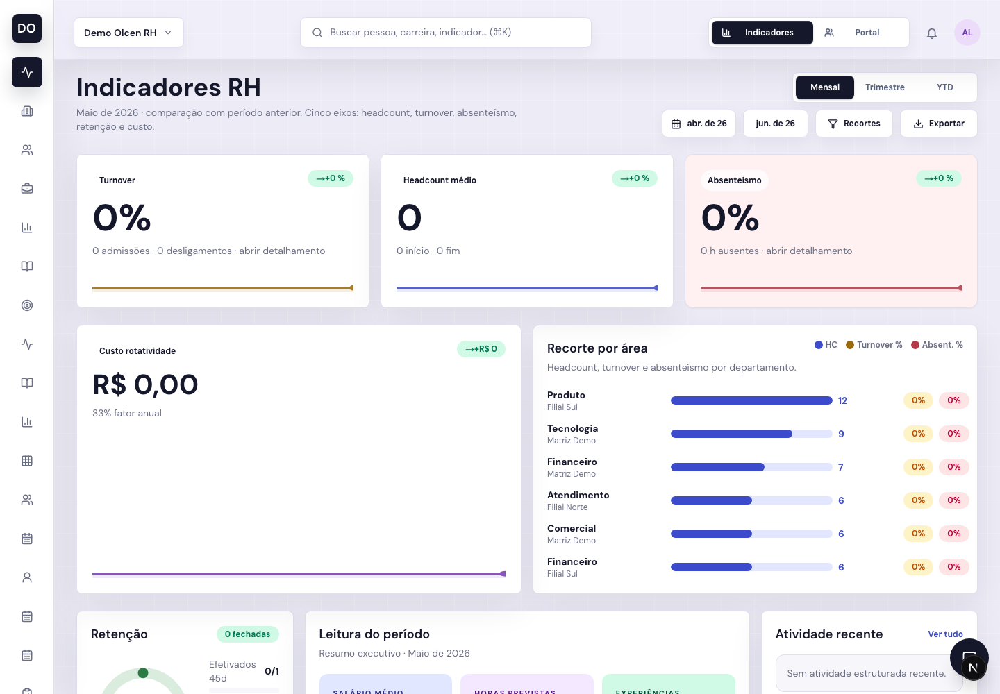
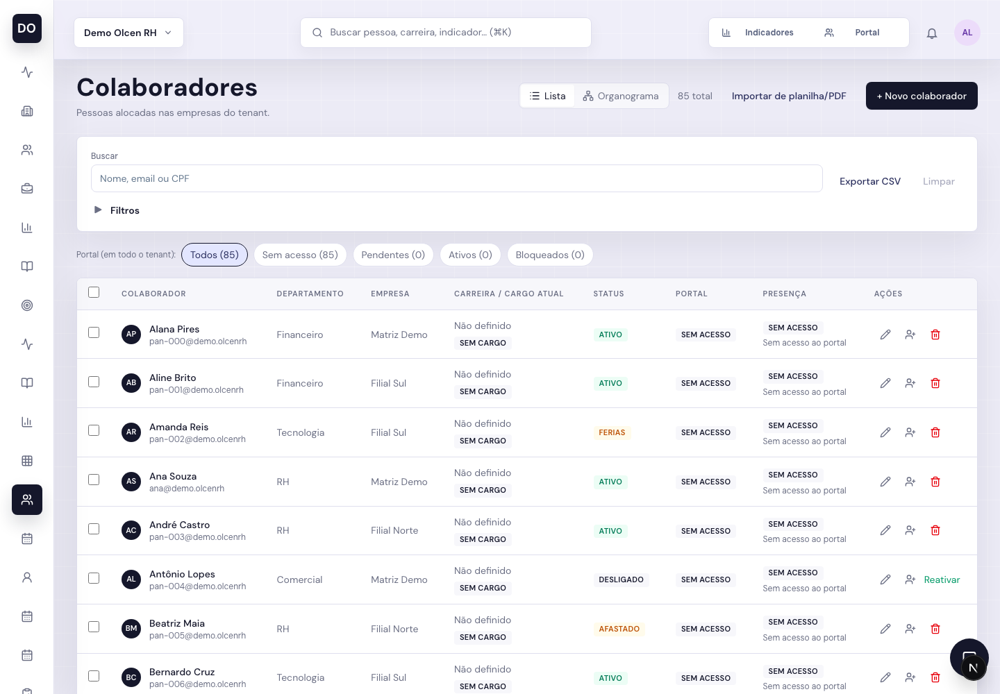
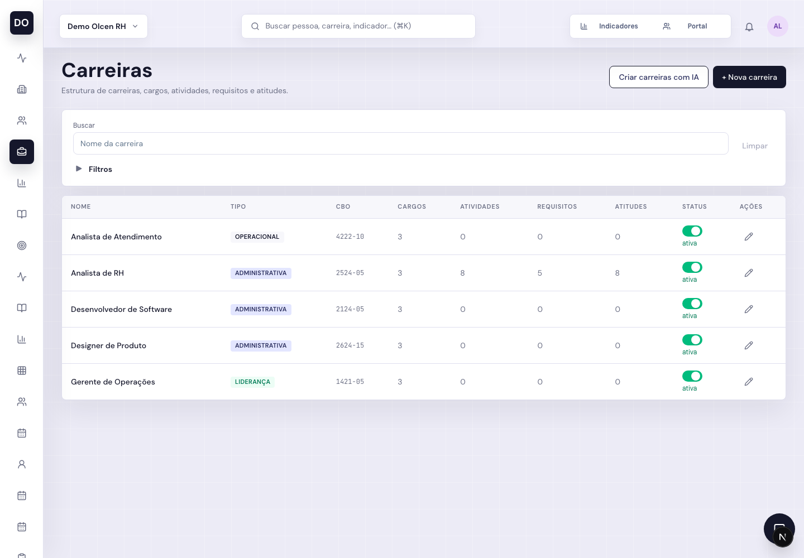
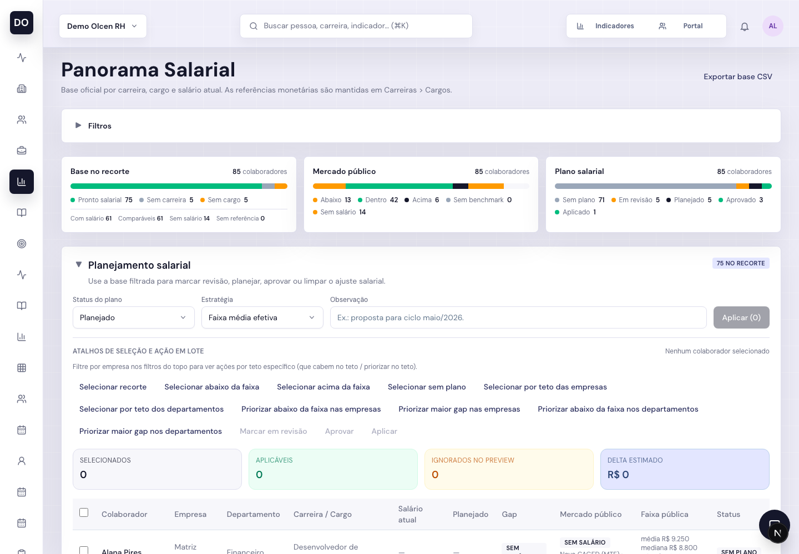
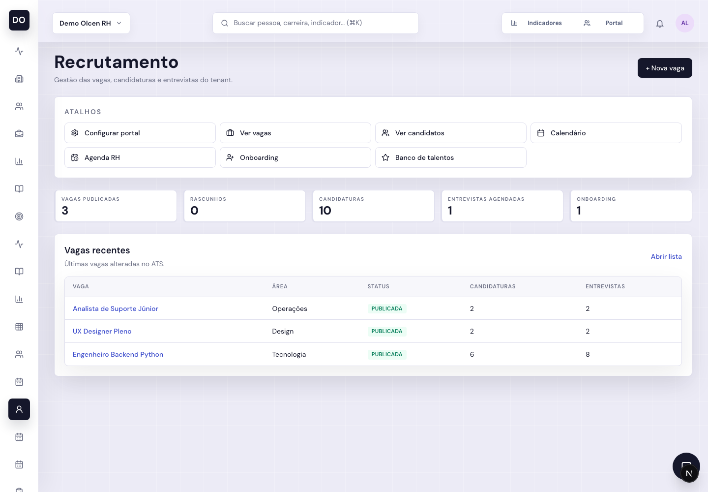
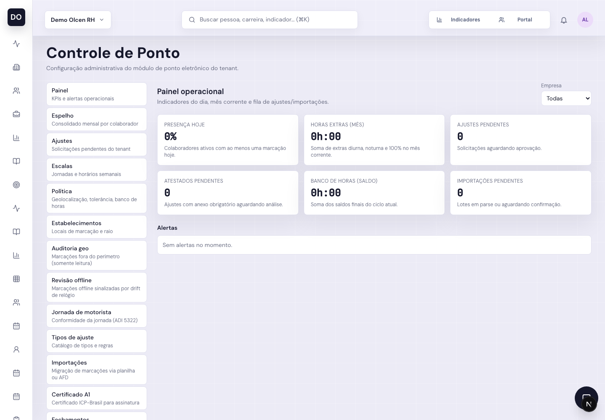
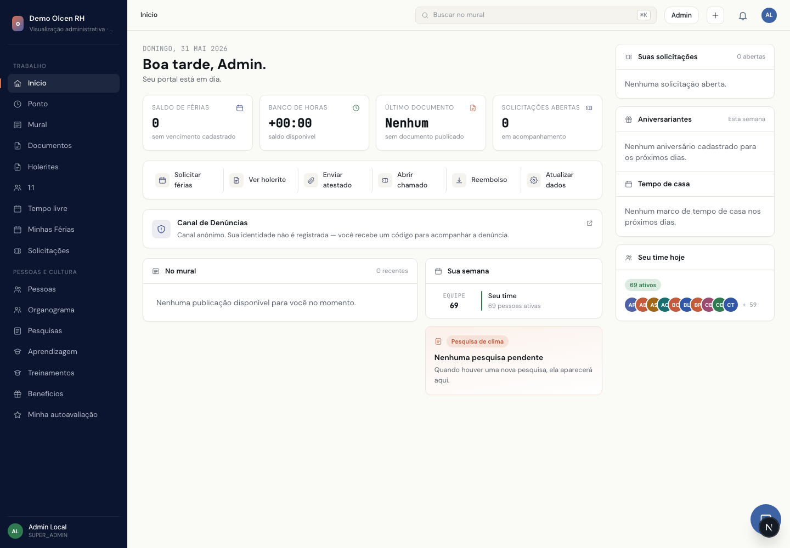

<section class="cover-slide">
  
  
Portfólio de produto

  <h1>Olcen</h1>
  
Produtos para organizar pessoas, clientes, jornada e atendimento em uma operação mais clara.

</section>

---
routeAlias: produtos
---

<section class="menu-slide">
  

    
Menu inicial

    <h1>Escolha o produto</h1>
    
Cada linha pode ter sua própria narrativa comercial, demonstração e próximos passos.

  

  

    

      01
      <h3>RU Olcen</h3>
      
Gestão de pessoas, recrutamento, portal do colaborador, ponto, férias e remuneração em uma base única.

      <Link to="rh" title="Abrir RU Olcen" />
    

    

      02
      <h3>Olcen CRM</h3>
      
Relacionamento comercial com histórico, oportunidades e próximos passos visíveis para o time.

      <Link to="crm" title="Abrir Olcen CRM" />
    

    

      03
      <h3>Olcen Ponto</h3>
      
Controle de jornada e registro de ponto com foco em clareza operacional.

      <Link to="ponto" title="Abrir Olcen Ponto" />
    

    

      04
      <h3>Olcen Voz</h3>
      
Experiências por voz para apoiar atendimento, triagem e rotinas digitais.

      <Link to="voz" title="Abrir Olcen Voz" />
    

  

</section>

---
routeAlias: rh
---

<section class="section-slide">
  <Link to="produtos" title="Voltar ao menu" />
  
Produto 01

  <h1>RU Olcen</h1>
  
Uma plataforma para centralizar a operação de RH: pessoas, cargos, competências, recrutamento, jornada, férias, portal e decisões de remuneração.

</section>

---
layout: two-cols
---

# O problema que o RU resolve

Times de RH em crescimento operam com dados espalhados entre planilhas, e-mail, WhatsApp, documentos e sistemas sem conexão.

::right::

  
O RH perde tempo conciliando dados de colaboradores, cargos, vagas e ponto.

  
A liderança decide com baixa visibilidade sobre turnover, absenteísmo e remuneração.

  
O colaborador depende do RH para tarefas simples que poderiam ser autoatendidas.

---

# Proposta de valor

  

    01
    <h3>Base única de pessoas</h3>
    
Empresas, departamentos, colaboradores, cargos, carreiras e status em uma estrutura centralizada.

  

  

    02
    <h3>Rotinas rastreáveis</h3>
    
Recrutamento, onboarding, ponto, férias, solicitações e denúncias com histórico e responsáveis.

  

  

    03
    <h3>Decisão com dados</h3>
    
Indicadores, panorama salarial, competências, avaliações e plano de ação para orientar prioridades.

  

---
---

<section class="visual-slide">
  

    
Visão executiva

    <h1>Indicadores RH</h1>
    
Painel para acompanhar headcount, turnover, absenteísmo, retenção, custo de rotatividade e recortes por área.

  

  
</section>

---

<section class="visual-slide">
  

    
Base de pessoas

    <h1>Colaboradores e estrutura</h1>
    
Cadastro de colaboradores com empresa, departamento, status, acesso ao portal, presença e ações administrativas.

  

  
</section>

---

<section class="visual-slide">
  

    
Cargos e desenvolvimento

    <h1>Carreiras, competências e CHA</h1>
    
O RU organiza cargos, níveis, requisitos, atividades, atitudes e grade de complexidade para apoiar avaliações e desenvolvimento.

  

  
</section>

---

<section class="visual-slide">
  

    
Remuneração

    <h1>Panorama salarial</h1>
    
Comparação entre salário atual, carreira, cargo e benchmarks públicos para planejar ajustes com mais critério.

  

  
</section>

---

<section class="visual-slide">
  

    
Aquisição de talentos

    <h1>Recrutamento e seleção</h1>
    
Gestão de vagas, candidatos, candidaturas, entrevistas, banco de talentos, portal público e análise de aderência por IA.

  

  
</section>

---

<section class="visual-slide">
  

    
Jornada e DP

    <h1>Controle de ponto</h1>
    
Painel operacional para presença, horas extras, banco de horas, ajustes, escalas, auditoria geográfica, importações e fechamentos.

  

  
</section>

---

<section class="visual-slide">
  

    
Experiência do colaborador

    <h1>Portal do colaborador</h1>
    
Autoatendimento para mural, ponto, documentos, holerites, 1:1, tempo livre, férias, solicitações, pessoas, pesquisas e benefícios.

  

  
</section>

---

# Cobertura funcional

  

    01
    <h3>Operação de RH</h3>
    
Colaboradores, empresas, departamentos, usuários, calendário, férias, ponto e solicitações.

  

  

    02
    <h3>Talentos</h3>
    
Recrutamento, entrevistas, onboarding, exames ocupacionais, treinamentos e banco de talentos.

  

  

    03
    <h3>Desenvolvimento</h3>
    
Carreiras, CHA, avaliação comportamental, 1:1, ninebox, plano de ação e PDI.

  

  

    04
    <h3>Decisão</h3>
    
Indicadores de RH, panorama salarial, benchmarks públicos e recortes por área.

  

  

    05
    <h3>Portal</h3>
    
Mural, documentos, holerites, benefícios, pesquisas, organograma e autoatendimento.

  

  

    06
    <h3>Governança</h3>
    
Canal de denúncias, auditoria, permissões, retenção de dados e histórico operacional.

  

---
routeAlias: crm
---

<section class="section-slide">
  <Link to="produtos" title="Voltar ao menu" />
  
Produto 02

  <h1>Olcen CRM</h1>
  
Um CRM para dar contexto ao relacionamento comercial e manter o próximo passo sempre visível.

</section>

---
layout: two-cols
---

# O problema

Vendas e atendimento perdem ritmo quando contatos, propostas e histórico ficam em conversas soltas.

::right::

  
Oportunidades somem por falta de acompanhamento.

  
Clientes repetem informações em cada interação.

  
Gestores não enxergam previsibilidade comercial.

---

# Valor do produto

  

    01
    <h3>Pipeline comercial</h3>
    
Etapas, oportunidades e responsáveis organizados em uma visão clara.

  

  

    02
    <h3>Histórico do cliente</h3>
    
Contexto de conversas, propostas e decisões em um só lugar.

  

  

    03
    <h3>Próximo passo</h3>
    
Ações comerciais ficam explícitas para reduzir perda de timing.

  

---
layout: two-cols
---

# Produto em ação

Use este slide para inserir uma captura real do Olcen CRM.

  Substitua o bloco ao lado por uma imagem em `public/screenshots/crm.png`.

::right::

  Olcen CRM

---
routeAlias: ponto
---

<section class="section-slide">
  <Link to="produtos" title="Voltar ao menu" />
  
Produto 03

  <h1>Olcen Ponto</h1>
  
Controle de jornada e registro de ponto com mais visibilidade para operação, liderança e conformidade.

</section>

---
layout: two-cols
---

# Onde entra

Empresas que dependem de escala operacional precisam saber quem está disponível, onde há inconsistência e o que exige correção.

::right::

  
Registros dispersos dificultam conferência e fechamento.

  
Gestores perdem tempo validando exceções manualmente.

  
A operação fica exposta a falhas de controle e comunicação.

---

# Valor do produto

  

    01
    <h3>Registro claro</h3>
    
Fluxo simples para acompanhar marcações e pendências da jornada.

  

  

    02
    <h3>Gestão de exceções</h3>
    
Alertas e visibilidade para tratar ajustes antes que virem retrabalho.

  

  

    03
    <h3>Base auditável</h3>
    
Histórico organizado para apoiar conferência, fechamento e governança.

  

---
routeAlias: voz
---

<section class="section-slide">
  <Link to="produtos" title="Voltar ao menu" />
  
Produto 04

  <h1>Olcen Voz</h1>
  
Interfaces por voz para tornar atendimento, triagem e rotinas digitais mais rápidas e naturais.

</section>

---
layout: two-cols
---

# Onde entra

Quando o atendimento exige agilidade, a voz reduz atrito e ajuda a capturar contexto sem depender de formulários longos.

::right::

  
Usuários explicam necessidades com menos atrito.

  
Times ganham contexto antes de assumir casos complexos.

  
Rotinas repetitivas podem ser guiadas com uma experiência mais direta.

---

# Valor do produto

  

    01
    <h3>Entrada natural</h3>
    
Conversas por voz ajudam a transformar intenção em próximo passo.

  

  

    02
    <h3>Triagem com contexto</h3>
    
Coleta informações relevantes antes do encaminhamento ou atendimento humano.

  

  

    03
    <h3>Experiência guiada</h3>
    
Fluxos orientados reduzem espera, dúvida e abandono em tarefas recorrentes.

  

---

# Próximos passos do portfólio

<section class="closing-slide">
  <h2>Completar cada produto com evidência real.</h2>
  
Para cada seção, os próximos slides devem trazer captura do produto, caso de uso principal, métrica de impacto e chamada comercial específica.

  <Link to="produtos" title="Voltar ao menu" />
</section>
